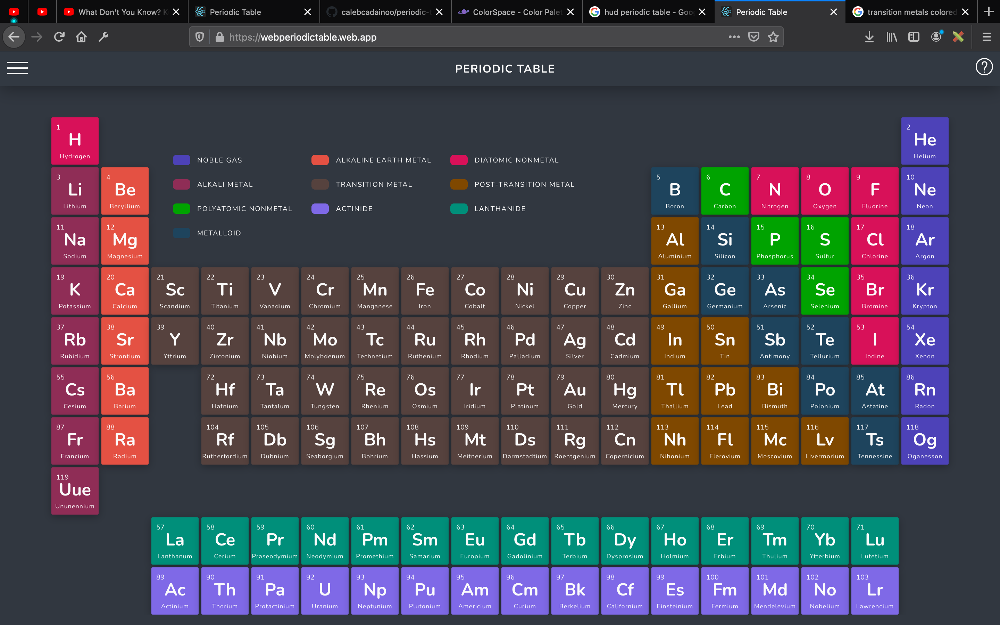
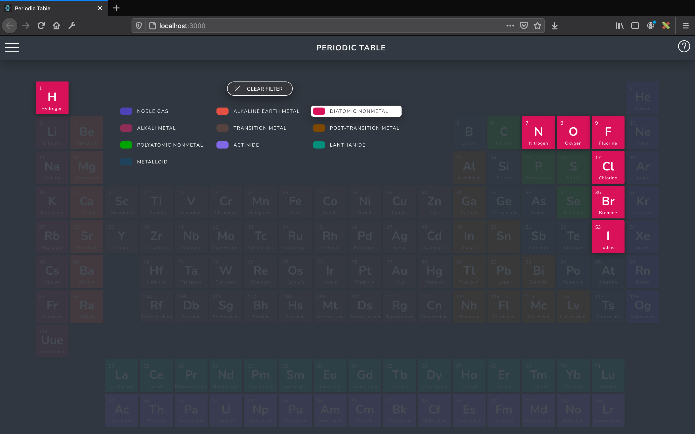
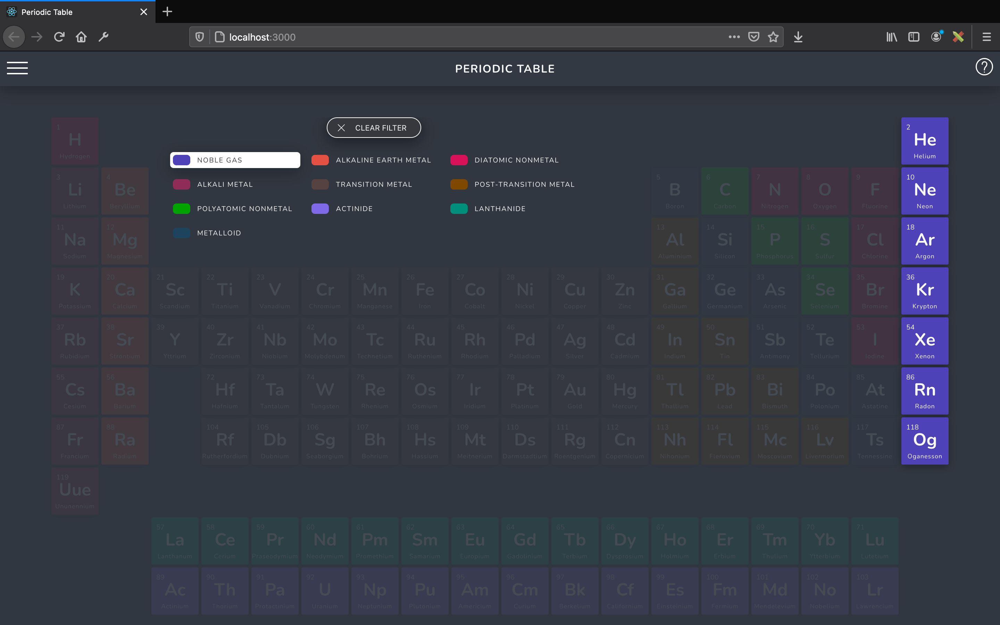
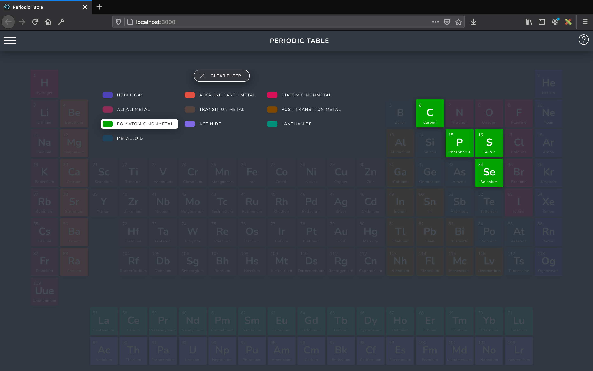
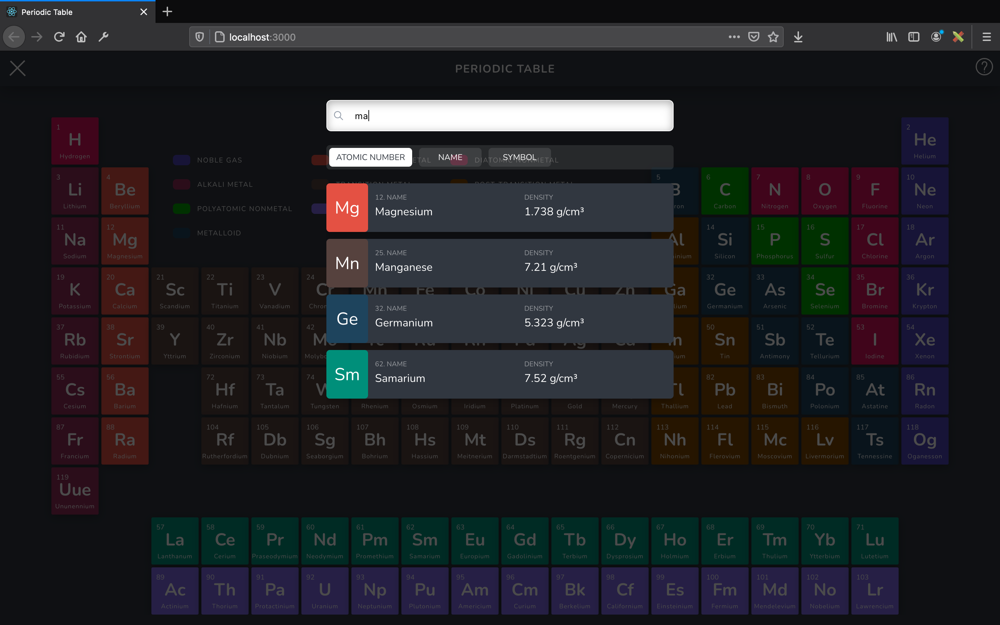
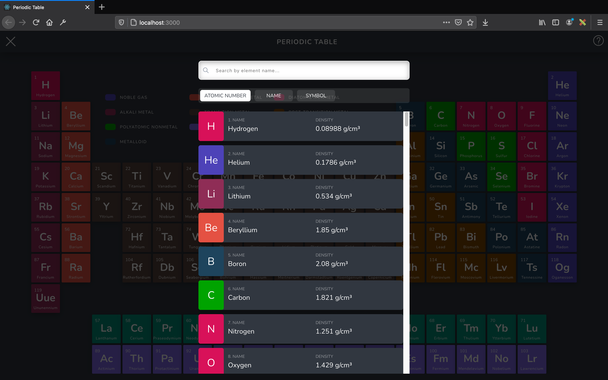
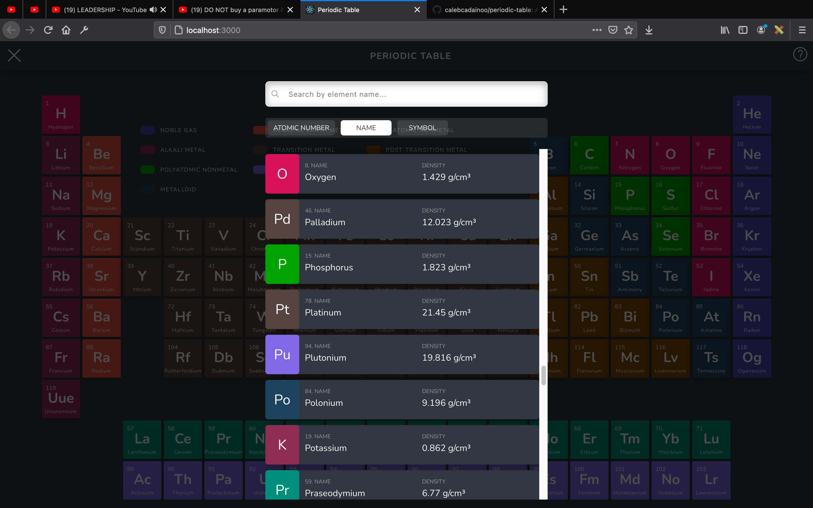
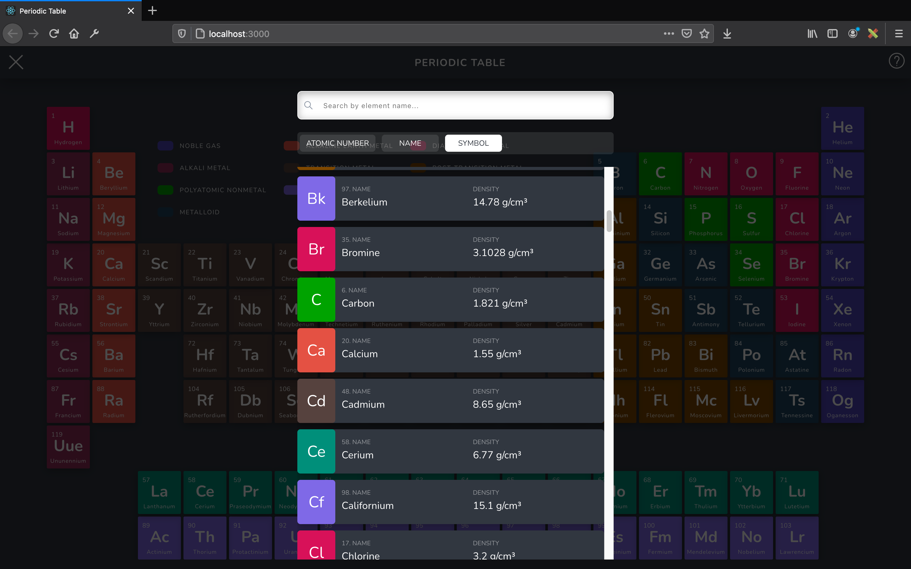

# Periodic Table 

An Educational Chemistry React app that visually shows the properties of the elements of a periodic table and the periodic table arrangements itself. It also shows the pictures of the elements as well. This ideal to teach in schools where there is limited access to pictures of some of these elements.


`NB:` This web app was built solely for educational purposes.

Happy learning, take a look around and explore:
https://webperiodictable.web.app/

# Functions
## 1. App Main View


## 2. Category Filter Highlight
### Filter by Diatomic Nonmetal

### Filter by Noble Gas

### Filter by Polyatomic Nonmetals


## 3. Search Sort Types
### Search from Textfield

### Sort by Atomic Number

### Sort by Name

### Sort by Symbol



### CSS Color Palettes
```sh
:root{
  --app-background: #313740;
  --app-column-counter: #1e2128;
  --app-row-counter: #252a32;
  --app-menu: #36383d;
  --app-menu-text: #fbfbfb;
  --app-popup-top: #323942;
  --app-popup-text: #2c3039;
  --app-popup-background: #fefefe;
}
```
REF: https://www.ducksters.com/science/chemistry/calcium.php